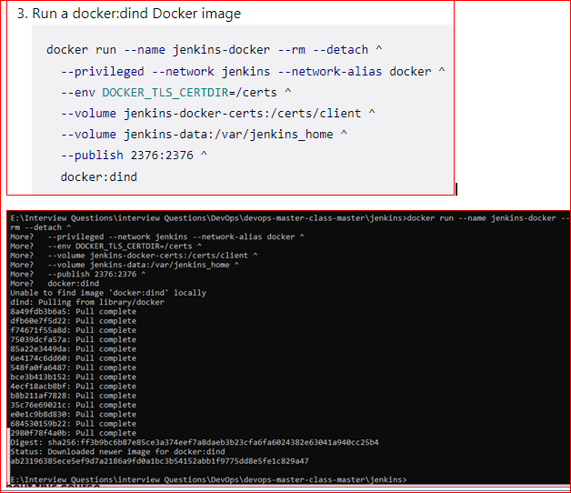
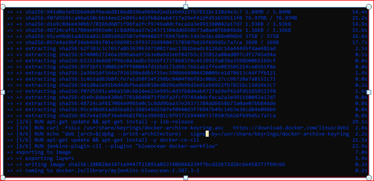
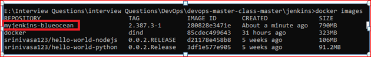
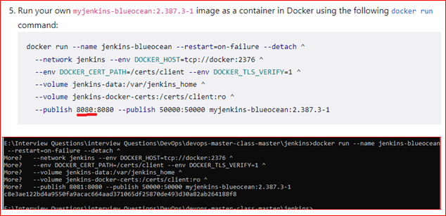

# Junkins-master
Author : Srinivasa Duggempudi.

### Table of Contents
### STACK                         
| No. | Questions |
|---- | ---------
|1 | [Junkins Introductions?](#Junkins-Introductions)|
|2 | [Install Junkins Docker?](#Install-Junkins-Docker)|
|3 | [What is TypeScript?](#what-is-typescript)|
|4 | [Write a pictorial diagram of Angular architecture?](#write-a-pictorial-diagram-of-angular-architecture)|
|5 | [What are the key components of Angular?](#what-are-the-key-components-of-angular)|
|6 | [What are directives?](#what-are-directives)|

### LINKED LIST                         
| No. | Questions |
|---- | ---------
|1 | [Custom Stack Implementation?](#custom-stack-implementation)|
|2 | [What is the difference between AngularJS and Angular?](#what-is-the-difference-between-angularjs-and-angular)|
|3 | [What is TypeScript?](#what-is-typescript)|
|4 | [Write a pictorial diagram of Angular architecture?](#write-a-pictorial-diagram-of-angular-architecture)|
|5 | [What are the key components of Angular?](#what-are-the-key-components-of-angular)|
|6 | [What are directives?](#what-are-directives)|
1. ### Junkins Introductions?

   
  **[⬆ Back to Top](#table-of-contents)**

2. ### Install Junkins Docker?
   Search  Docker – Junkins Installatin in Google 
                OR
   **URL : **  https://www.jenkins.io/doc/book/installing/docker/#on-windows
   
    **STEPS TO INSTALL  JUNKINS**
    
    **STEP :1**  open the CMD.
    
    **STEP :2**  Open the Junkins folder 
    
    
    
   **Step 3:**  Create a bridge network in Docker
    
     Run the command  :  **docker network create Jenkins**   (Make sure Docker is up and running in the System before running this command)
              
      
                        
  **Step 4:** In order to execute the docker commands in junkins nodes  download and run the **docker : dind** 
  
  Docker  image using the following docker run command 
  ```
  docker run --name jenkins-docker --rm --detach ^
  --privileged --network jenkins --network-alias docker ^
  --env DOCKER_TLS_CERTDIR=/certs ^
  --volume jenkins-docker-certs:/certs/client ^
  --volume jenkins-data:/var/jenkins_home ^
  --publish 2376:2376 ^
  docker:dind 
  
  ```
  
  
  
   **Step 5 :**  Edit or create the docker file inside the junkins project with the following code
   
   ```
      FROM jenkins/jenkins:2.387.3
     USER root
    RUN apt-get update && apt-get install -y lsb-release
     RUN curl -fsSLo /usr/share/keyrings/docker-archive-keyring.asc \
    https://download.docker.com/linux/debian/gpg
    RUN echo "deb [arch=$(dpkg --print-architecture) \
    signed-by=/usr/share/keyrings/docker-archive-keyring.asc] \
     https://download.docker.com/linux/debian \
    $(lsb_release -cs) stable" > /etc/apt/sources.list.d/docker.list
    RUN apt-get update && apt-get install -y docker-ce-cli
    USER jenkins
    RUN jenkins-plugin-cli --plugins "blueocean docker-workflow" 

   ``` 
  
  
  
  **Step 6 :**  Build a new docker image from this Dockerfile and assign the image a meaningful name, e.g. "myjenkins-blueocean:2.387.3-1":
  
  ``` 
    docker build -t myjenkins-blueocean:2.387.3-1 .
    
  ``` 
  Keep in mind that the process described above will automatically download the official Jenkins Docker image if this hasn’t been done before.
  
  
  
  **Step 7:** Check the docker images
  
  ```
      docker images
  ```
  
  
  
  **Step 8 :** Run the image.
  
  **Note  :**  Before running the image change the port from 8080 to 8081 because we run the another service in 8080.
   
      ```
         docker run --name jenkins-blueocean --restart=on-failure --detach ^
         --network jenkins --env DOCKER_HOST=tcp://docker:2376 ^
         --env DOCKER_CERT_PATH=/certs/client --env DOCKER_TLS_VERIFY=1 ^
         --volume jenkins-data:/var/jenkins_home ^
         --volume jenkins-docker-certs:/certs/client:ro ^
        --publish 8081:8080 --publish 50000:50000 myjenkins-blueocean:2.387.3-1
     ```
     
   
    
  
  
    **[⬆ Back to Top](#table-of-contents)**

3. ### What is TypeScript?
    TypeScript is a strongly typed superset of JavaScript created by Microsoft that adds optional types, classes, async/await and many other features, and compiles to plain JavaScript. Angular is written entirely in TypeScript as a primary language.
    You can install TypeScript globally as
    ```cmd
    npm install -g typescript
    ```
    Let's see a simple example of TypeScript usage:-
    ```typescript
    function greeter(person: string) {
        return "Hello, " + person;
    }

    let user = "Sudheer";

    document.body.innerHTML = greeter(user);
    ```
    The greeter method allows only string type as argument.

  **[⬆ Back to Top](#table-of-contents)**

4. ### Write a pictorial diagram of Angular architecture?
    The main building blocks of an Angular application are shown in the diagram below:-
    

  **[⬆ Back to Top](#table-of-contents)**

5. ### What are the key components of Angular?
    Angular has the key components below,
    1. **Component:** These are the basic building blocks of an Angular application to control HTML views.
    2. **Modules:** An Angular module is a set of angular basic building blocks like components, directives, services etc. An application is divided into logical pieces and each piece of code is called as "module" which perform a single task.
    3. **Templates:** These represent the views of an Angular application.
    4. **Services:** Are used to create components which can be shared across the entire application.
    5. **Metadata:** This can be used to add more data to an Angular class.

  **[⬆ Back to Top](#table-of-contents)**

6. ### What are directives?
    Directives add behaviour to an existing DOM element or an existing component instance.
    ```typescript
    import { Directive, ElementRef, Input } from '@angular/core';

    @Directive({ selector: '[myHighlight]' })
    export class HighlightDirective {
        constructor(el: ElementRef) {
           el.nativeElement.style.backgroundColor = 'yellow';
        }
    }
    ```

    Now this directive extends HTML element behavior with a yellow background as below
    ```html
    <p myHighlight>Highlight me!</p>
    ```
  **[⬆ Back to Top](#table-of-contents)**
